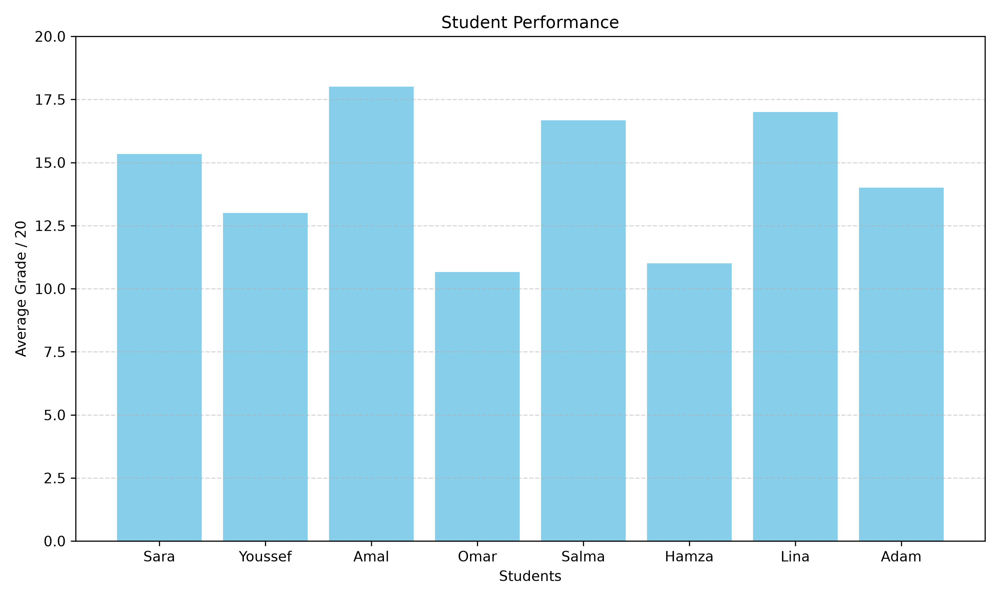

# Student Performance Analysis 📊

A beginner-friendly Python data analysis project exploring student academic performance using Pandas and Matplotlib.

## 📌 Project Overview

This project analyzes a dataset of student grades in Mathematics, Python, and English. It calculates individual averages, summarizes class performance, and visualizes the results using a bar chart.

## 🎯 Objectives

- Load and explore a CSV dataset using Pandas.
- Calculate individual student averages.
- Identify class performance statistics.
- Visualize student averages with Matplotlib.
- Export the analyzed data to a new CSV file.

## 🛠️ Technologies

- Python
- Pandas
- Matplotlib

## 📁 Project Structure

```text
student-performance-analysis/
├── data/
│   ├── students.csv
│   └── student_results.csv
├── images/
│   └── student_performance.png
├── main.py
├── requirements.txt
└── README.md
```

## ⚙️ Installation and Usage

### 1. Clone the repository

```bash
git clone https://github.com/YOUR-USERNAME/student-performance-analysis.git
cd student-performance-analysis
```

Replace `YOUR-USERNAME` with your GitHub username.

### 2. Install dependencies

```bash
python -m pip install -r requirements.txt
```

### 3. Run the analysis

```bash
python main.py
```

The script loads the dataset, calculates student averages and class statistics, displays a chart, and saves the results to `data/student_results.csv`.

## 📊 Results

The analysis includes:
- Individual student averages.
- Class average, highest average, and lowest average.
- A bar chart comparing student performance.

### Student Performance Chart



## 📂 Dataset

The dataset contains fictional grades for eight students in three subjects. All grades are on a scale of 20.

## 🚀 Future Improvements

- Add more students and subjects.
- Compare performance across different subjects.
- Explore correlations between subjects.
- Add more visualizations and interactive analysis.

## 👩‍💻 Author

Fatima Zahra Tittich

